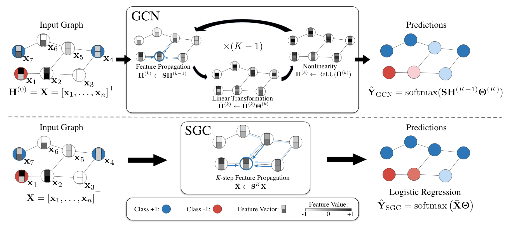

## Simplifying Graph Convolutional Networks

[](#python)
[](https://opensource.org/licenses/MIT) 

#### Updates
* As pointed out by #23, there was a subtle bug in our preprocessing code for the reddit dataset. After fixing this bug, SGC achieves a F1 score of 95.0 (previously, it was 94.9).
* Practical advice: it is often very helpful to normalize the features to have zero mean with standard deviation one to accelerate the convergence of SGC (and many other linear models). For example, we apply this normalization for [the reddit dataset](./utils.py#L119). Please consider doing this when applying SGC to other datasets. For some relevant discussions, see [Ross et al, 2013](https://arxiv.org/pdf/1305.6646.pdf) and [Li and Zhang, 1998](https://www.jstor.org/stable/25051187?seq=1#metadata_info_tab_contents).

#### Authors: 
* [Felix Wu](https://scholar.google.com.tw/citations?user=sNL8SSoAAAAJ&hl=en)*
* [Tianyi Zhang](https://scholar.google.com/citations?user=OI0HSa0AAAAJ&hl=en)*
* [Amauri Holanda de Souza Jr.](https://scholar.google.com/citations?hl=en&user=lP0LBI4AAAAJ&view_op=list_works&sortby=pubdate)*
* [Christopher Fifty](https://scholar.google.com/citations?user=lg2M2RYAAAAJ&hl=en)
* [Tao Yu](http://jhc.sjtu.edu.cn/public/home/taoyu/)
* [Kilian Q. Weinberger](http://kilian.cs.cornell.edu/index.html)

*: Equal Contribution

### Overview
This repo contains an example implementation of the Simple Graph Convolution
(SGC) model, described in the ICML2019 paper [Simplifying Graph Convolutional Networks](https://arxiv.org/abs/1902.07153).

SGC removes the nonlinearities and collapes the weight matrices in Graph Convolutional Networks (GCNs) and is essentially a linear model. 
For an illustration, 

SGC achieves competitive performance while saving much training time. For reference, on a GTX 1080 Ti,

Dataset | Metric | Training Time 
:------:|:------:|:-----------:|
Cora    | Acc: 81.0 %     | 0.13s
Citeseer| Acc: 71.9 %     | 0.14s
Pubmed  | Acc: 78.9 %     | 0.29s
Reddit  | F1:  94.9 %     | 2.7s

This home repo contains the implementation for citation networks (Cora, Citeseer, and Pubmed) and social network (Reddit).
We have a work-in-progress branch [ablation](https://github.com/Tiiiger/SGC/tree/ablation), containing additional codebase for our ablation studies.

If you find this repo useful, please cite: 
```
@InProceedings{pmlr-v97-wu19e,
  title = 	 {Simplifying Graph Convolutional Networks},
  author = 	 {Wu, Felix and Souza, Amauri and Zhang, Tianyi and Fifty, Christopher and Yu, Tao and Weinberger, Kilian},
  booktitle = 	 {Proceedings of the 36th International Conference on Machine Learning},
  pages = 	 {6861--6871},
  year = 	 {2019},
  publisher = 	 {PMLR},
}
```

#### Other reference implementations
Other reference implementations can be found in the follwing libraries. Note that in
these examples, the hyperparameters are potentially different and
the results would be different from the paper reported ones.

- *Deep Graph Library*: [example](https://github.com/dmlc/dgl/tree/master/examples/pytorch/sgc).
- *PyTorch Geometric*:
[documentation](https://pytorch-geometric.readthedocs.io/en/latest/modules/nn.html#torch_geometric.nn.conv.SGConv)
and [example](https://github.com/rusty1s/pytorch_geometric/blob/master/examples/sgc.py). 
- *Spektral*: [example](https://github.com/danielegrattarola/spektral/blob/master/examples/node_classification_simple_gc.py)
- *StellarGraph*: [example](https://github.com/stellargraph/stellargraph/blob/develop/demos/node-classification/sgc/sgc-node-classification-example.ipynb)
- *tf_geometric*: [example](https://github.com/CrawlScript/tf_geometric/blob/master/demo/demo_sgc.py)

### Dependencies
Our implementation works with PyTorch>=1.0.0 Install other dependencies: `$ pip install -r requirement.txt`

### Data
We provide the citation network datasets under `data/`, which corresponds to [the public data splits](https://github.com/tkipf/gcn/tree/master/gcn/data).
Due to space limit, please download reddit dataset from [FastGCN](https://github.com/matenure/FastGCN/issues/9) and put `reddit_adj.npz`, `reddit.npz` under `data/`.

### Usage
Citation Networks: We tune the only hyperparameter, weight decay, with hyperopt and put the resulting hyperparameter under `SGC-tuning`. 
See `tuning.py` for more details on hyperparameter optimization.
```
$ python citation.py --dataset cora --tuned
$ python citation.py --dataset citeseer --tuned --epochs 150 
$ python citation.py --dataset pubmed --tuned
```

Reddit:
```
$ python reddit.py --inductive --test
```
### Downstream
We collect the code base for downstream tasks under `downstream`. Currently, we
are releasing only SGC implementation for text classification.

### Acknowledgement
This repo is modified from [pygcn](https://github.com/tkipf/pygcn), and [FastGCN](https://github.com/matenure/FastGCN).

We thank *Deep Graph Library* team for helping providing a reference implementation of SGC and benchmarking SGC in *Deep Graph Library*.
We thank Matthias Fey, author of *PyTorch Geometric*, for his help on providing a reference implementation of SGC within *PyTorch Geometric*.
We thank Daniele Grattarola, author of *Spektral*, for his help on providing a reference implementation of SGC within *Spektral*.
